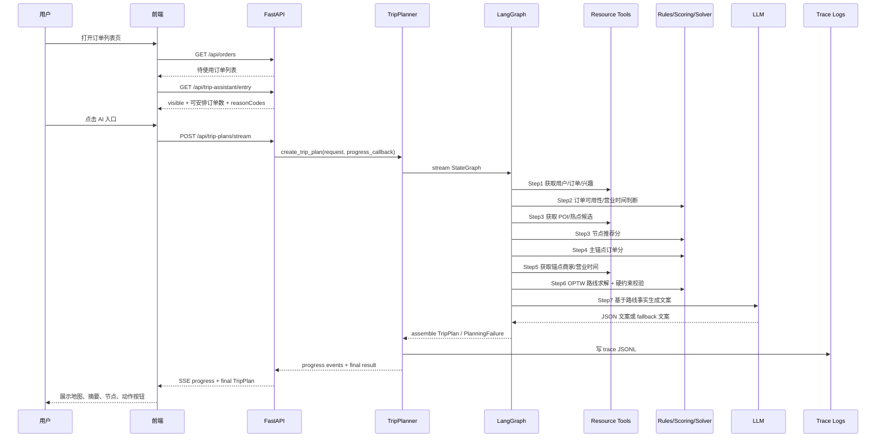
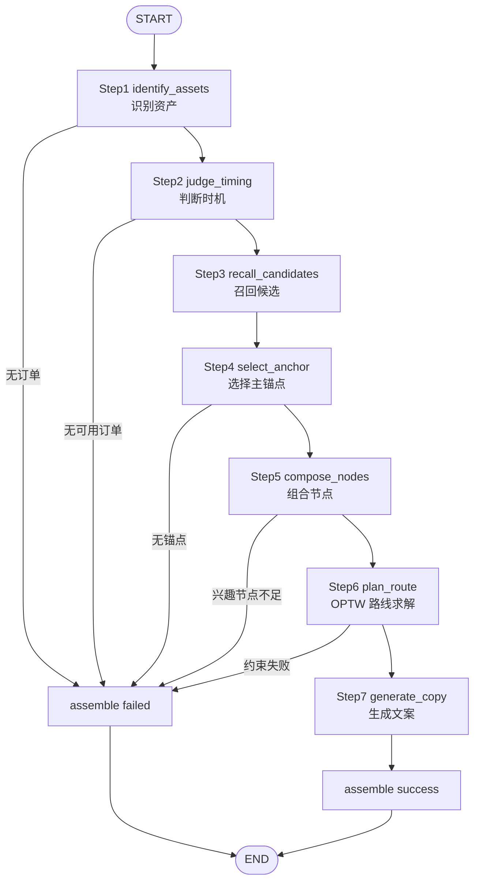

# RoutePilot V1 AI 行程助手

RoutePilot V1 是一个面向「订单列表页」的一期 AI 行程推荐模块。它从用户的待使用订单出发，结合用户位置、兴趣信号、商家营业规则、POI / 热点候选、时间窗、总时长和节点数约束，生成一条最近周末可执行的本地生活行程。

当前版本只做「AI 推荐行程页模块」主流程，不做多轮追问、真实下单/核销、真实地图路网、线上频控、真实订单中心 RPC。资源获取先用进程内 mock 数据模拟，后续可按工具边界替换为公司内部 RPC。

## 当前状态

- 后端已经从旧的多层转发结构重构为固定 7 步 LangGraph 工作流。
- 规则、打分、路线求解全部在 Python 确定性代码里执行。
- LLM 只负责 Step 7 展示文案，不能决定路线事实。
- 路线求解把「选哪些节点 + 怎么排序」建模为 OPTW，优先使用 Google OR-Tools，异常时自动降级启发式。
- 前端保留订单列表页、AI 入口卡、规划页、地图、摘要卡、完整节点列表和动作按钮。

## 技术栈

| 层 | 技术 |
|---|---|
| 前端 | React 18, TypeScript, Vite, Tailwind CSS, Leaflet / React-Leaflet |
| 后端 API | FastAPI, Uvicorn |
| 后端契约 | Pydantic v2, pydantic-settings |
| Agent 编排 | LangGraph `StateGraph` |
| 工具封装 | LangChain Core `@tool` |
| LLM | `langchain-openai` + OpenAI-compatible endpoint，DashScope compatible-mode 可用 |
| 路线优化 | Google OR-Tools Routing Solver + 贪心插入 / 2-opt 兜底 |
| 日志 | loguru 控制台日志 + JSONL runtime 日志 + trace JSONL |
| 测试 | pytest, FastAPI TestClient, TypeScript `tsc -b`, Vite build |

## 产品范围

一期主流程：

1. 订单列表页读取待使用订单。
2. `GET /api/trip-assistant/entry` 做轻量 precheck，决定是否展示 AI 入口卡。
3. 用户点击入口进入规划页。
4. 前端通过 `POST /api/trip-plans/stream` 订阅规划进度。
5. 后端执行固定 7 步工作流，返回 `TripPlan` 或 `PlanningFailure`。
6. 前端展示地图、概述卡、推荐理由、路线指标、节点卡和动作按钮。

非一期范围：

- 不接真实订单/RPC，只保留工具接缝。
- 不做多轮对话改路线。
- 不做真实路网 API，当前使用 haversine 距离和平均速度估算。
- 不做真实核销/预约/购买动作，按钮只记录点击。
- 不做线上级频控。前端仅保留「不感兴趣」本地隐藏逻辑。


## 运行流程图



## 后端 7 步工作流



## 规则和打分机制

### 硬规则

硬规则集中在 `backend/app/agent/constraints.py`：

- `MAX_TOTAL_MINUTES = 300`：总时长最多 5 小时。
- `MIN_NODES = 2`、`MAX_NODES = 5`：路线节点数量必须在 2 到 5 之间。
- `is_order_usable_today`：订单必须是 `unused`，当天在可用星期内，商家状态正常，订单可用时间窗与商家营业时间有交集。
- `filter_recommendable`：过滤异常/闭店 POI。
- `validate_route`：统一产出 `RuleCheck`，blocking 规则失败则整条路线失败。

### 打分公式

打分集中在 `backend/app/agent/scoring.py`，权重表 `WEIGHTS` 可直接调参。

| 公式 | 函数 | 作用 |
|---|---|---|
| 主锚点订单分 | `score_anchor` | 从可用订单中选择最适合作为路线目标的订单 |
| 节点推荐分 | `score_node` | 给兴趣/POI/热点候选打分，并作为 OPTW profit 输入 |
| 路线整体分 | `score_route` | 对最终路线做可解释评分，进入返回结果和 trace |

主锚点订单分包含：

- 今天可用 `usability`
- 有效期紧迫度 `expiry_urgency`
- 距离便利度 `distance`
- 用户偏好匹配 `preference`
- 组合潜力 `combo_potential`
- 订单价值 `value`
- 预约风险惩罚 `reservation`
- 排队风险惩罚 `queue`

节点推荐分包含：

- 价值 `profit_value`
- 兴趣匹配 `interest_match`
- 距离便利 `distance`
- 热度 `heat`
- 口碑 `rating`
- 偏好匹配 `preference`
- 绕路惩罚 `detour`
- 履约风险惩罚 `risk`

路线整体分包含：

- 主订单使用概率 `anchor_usage`
- 总时长/距离合理性 `distance_reason`
- 顺序合理性 `order_reason`
- 时间可执行性 `time_feasible`
- 兴趣丰富度 `interest_rich`
- 顺路加购潜力 `combo_purchase`
- 路线复杂度惩罚 `complexity`

### 路线求解

路线求解在 `backend/app/agent/route_solver.py`：

- 建模为带时间窗的定向问题 OPTW。
- 起点是用户当前位置。
- 锚点订单设为必达节点。
- 其他兴趣点/热点/POI 是可选节点。
- 节点 profit 来自 `score_node`，在 `plan_route.py` 里放大为整数，避免 OR-Tools 因弧成本过高丢掉有价值节点。
- 优先 OR-Tools Routing Solver。
- OR-Tools 不可用、超时或无可行解时，自动降级到贪心插入 + 2-opt。

## 数据与工具层

当前资源数据来自 `backend/app/mock/fixtures.py`，包括：

- 用户：深圳单用户 `u_mock_001`，含当前位置和偏好标签。
- 兴趣信号：收藏、浏览、购买、搜索等来源。
- 商家：粤菜、咖啡、Brunch、甜品、火锅、轻食等。
- 订单：6 张待使用订单 + 1 张退款订单用于规则验证。
- POI：博物馆、深圳湾步道、万象天地市集、书店等。
- 天气：最近周末天气快照。
- scenario：`no_orders`、`weekend_unavailable`、`merchant_closed`、`route_too_long`、`no_poi`。

资源工具在 `backend/app/tools/resource_tools.py`，用 LangChain `@tool` 包装：

- `fetch_user_profile`
- `fetch_unused_orders`
- `fetch_merchant_info`
- `fetch_interest_signals`
- `fetch_nearby_pois`
- `fetch_local_hotspots`
- `fetch_weather`

工具统一返回 `ToolResult`，包含 `toolName`、`status`、`summary`、`data`、`error`、`latencyMs`、`traceId`。未来接真实 RPC 时，应优先替换工具内部实现，保持函数签名和返回契约稳定。

## LLM 文案生成

LLM 只在 Step 7 使用，相关文件：

- `backend/app/agent/prompts.py`：文案 prompt，规定 summary、节点标题、节点理由的长度和 JSON 输出格式。
- `backend/app/services/llm.py`：构造 `ChatOpenAI`，调用 DashScope/OpenAI-compatible 模型，解析 JSON，做字段裁剪和 fallback。
- `backend/app/agent/nodes/generate_copy.py`：提取路线事实，调用 LLM 服务，把文案写回节点。

重要约束：

- LLM 不决定路线节点、不改顺序、不发明商家、时间、距离、优惠或订单状态。
- LLM 输出 JSON 不合法、模型不可用、无 key、超时等情况都会降级模板文案，主流程不失败。
- 自动化测试通过 `ROUTEPILOT_TEST_FAKE_LLM=1` 固定走测试文案。

## API

当前真实注册的 API：

| Method | Path | 说明 |
|---|---|---|
| GET | `/api/orders` | 返回当前用户待使用订单列表 |
| GET | `/api/orders/{order_id}` | 查询单个待使用订单 |
| GET | `/api/trip-assistant/entry` | 订单列表页 AI 入口 precheck |
| POST | `/api/trip-plans` | 同步生成行程 |
| POST | `/api/trip-plans/stream` | SSE 生成行程，返回 progress + final |
| GET | `/api/trip-plans/{plan_id}` | 读取进程内已生成行程 |
| POST | `/api/tracking` | 前端埋点记录 |
| POST | `/api/trip-actions/execute` | 节点动作点击记录，本期不接真实履约 |

已移除或不再注册：

- `GET /api/health`
- `/api/mock/*`
- `/api/routes/estimate`
- `/api/planning-logs`
- `/api/user/*`
- `/api/merchants/*`
- `/api/pois/*`
- `/api/hotspots`

## 日志与可观测性

| 文件/目录 | 说明 |
|---|---|
| `backend/logs/runtime.jsonl` | loguru 序列化运行日志，按 `trace_id` 关联 |
| `backend/logs/traces/*.jsonl` | 单次规划 trace，每行一个 record：meta/event/result |
| `TripTrace.add_event` | 记录每步状态、耗时、关键计数、得分、失败码 |
| API 返回 `planningLogFile` | 成功或失败都会返回 trace 文件路径，便于回放 |

trace 示例结构：

```json
{"record":"meta","trace_id":"...","user_id":"u_mock_001","scenario":null}
{"record":"event","trace_id":"...","step":"plan_route","status":"success","data":{"route_engine":"ortools"}}
{"record":"result","trace_id":"...","status":"success","failure_code":"","plan_id":"plan_xxx"}
```

## 本地启动

### 后端

```bash
cd /Users/bytedance/hello-agents/RoutePilot_V1/backend
python3 -m venv .venv
.venv/bin/python -m pip install -r requirements.txt
PYTHONPATH=. .venv/bin/python -m uvicorn app.main:app --host 127.0.0.1 --port 8011
```

如果 `8000` 未被占用，也可以使用 `--port 8000`。当前联调环境中 `8000` 被其他服务占用，所以前后端联调用 `8011`。

### 前端

```bash
cd /Users/bytedance/hello-agents/RoutePilot_V1/frontend
npm install
VITE_API_BASE_URL=http://127.0.0.1:8011 npm run dev -- --host 127.0.0.1 --port 5173
```

打开：

```text
http://127.0.0.1:5173/
```

### LLM 环境变量

根目录 `.env` 或 `backend/.env` 可配置：

```bash
DASHSCOPE_API_KEY=你的 DashScope API Key
DASHSCOPE_API_BASE=https://dashscope.aliyuncs.com/compatible-mode/v1
DASHSCOPE_MODEL=qwen-plus
```

或 OpenAI-compatible：

```bash
ROUTEPILOT_LLM_API_KEY=你的 API Key
ROUTEPILOT_LLM_BASE_URL=https://api.openai.com/v1
ROUTEPILOT_LLM_MODEL=gpt-4o-mini
```

`DASHSCOPE_API_KEY` 存在时优先使用 DashScope compatible-mode。不要提交真实 key。

## 测试与验证

### 后端单测

```bash
cd backend
PYTHONPATH=. .venv/bin/python -m pytest -q
```

注意：当前 `.venv/bin/pytest` 的 shebang 可能指向旧路径，建议使用 `.venv/bin/python -m pytest`。

覆盖内容：

- API 注册与返回契约
- 成功规划路径
- 无订单、无可用时间、无 POI 等失败路径
- 规则函数
- 打分函数
- OR-Tools 与 heuristic 路线求解路径

### 前端检查

```bash
cd frontend
npm run check
npm run build
```

### 手工联调

```bash
curl -sS http://127.0.0.1:8011/api/trip-assistant/entry
curl -sS -X POST http://127.0.0.1:8011/api/trip-plans \
  -H 'Content-Type: application/json' \
  -d '{"userId":"u_mock_001","targetWindow":"nearest_weekend","includeDebug":true}'
```

失败场景：

```bash
curl -sS -X POST http://127.0.0.1:8011/api/trip-plans \
  -H 'Content-Type: application/json' \
  -d '{"userId":"u_mock_001","targetWindow":"nearest_weekend","scenario":"no_orders"}'
```

## 前端模块说明

| 文件 | 说明 |
|---|---|
| `frontend/src/main.tsx` | React 应用入口，挂载根节点并引入全局样式 |
| `frontend/src/App.tsx` | React Router 路由定义，连接订单列表页和规划页 |
| `frontend/src/api/client.ts` | API Client，封装 fetch、SSE 解析、tracking 和 action 调用 |
| `frontend/src/types/api.ts` | 前端 TypeScript API 类型，和后端 Pydantic camelCase 契约对齐 |
| `frontend/src/pages/OrderListPage.tsx` | 订单列表页，加载订单和 AI 入口，处理关闭/不感兴趣逻辑 |
| `frontend/src/pages/PlanningPage.tsx` | 规划页，订阅 SSE、展示当前进度、地图、摘要、完整节点和动作按钮 |
| `frontend/src/components/AssistantEntryCard.tsx` | 订单列表页 AI 入口卡 |
| `frontend/src/components/OrderCard.tsx` | 待使用订单卡片 |
| `frontend/src/components/TripMap.tsx` | Leaflet 地图，展示用户位置、节点 marker 和 polyline |
| `frontend/src/components/TripSummaryCard.tsx` | 行程摘要指标卡 |
| `frontend/src/components/TripNodeCard.tsx` | 完整行程节点卡，含时间、距离、动作按钮 |
| `frontend/src/components/ActionToast.tsx` | 动作反馈 toast |
| `frontend/src/components/EmptyState.tsx` | 空态/失败态组件 |
| `frontend/src/components/MobileShell.tsx` | 移动端容器壳，统一标题和页面宽度 |
| `frontend/src/components/PlanningSteps.tsx` | 规划步骤展示组件，当前主页面已改为只展示当前状态 |
| `frontend/src/components/RuleExplainPanel.tsx` | 规则解释面板组件，保留给 debug/explainability 展示 |
| `frontend/src/styles/index.css` | Tailwind 和全局样式 |
| `frontend/src/vite-env.d.ts` | Vite 类型声明 |

## 后端 Python 文件总览

本节覆盖 `backend/app` 和 `backend/tests` 下所有 Python 文件。

### `backend/app`

| 文件 | 说明 |
|---|---|
| `backend/app/__init__.py` | Python 包标记文件，无业务逻辑 |
| `backend/app/config.py` | Pydantic Settings 配置入口，加载 `.env`，提供 LLM、stream、timeout 等配置 |
| `backend/app/logging_setup.py` | 初始化 loguru，输出控制台日志和 `backend/logs/runtime.jsonl` |
| `backend/app/main.py` | FastAPI app 入口，配置 CORS，注册聚合路由 |

### `backend/app/api`

| 文件 | 说明 |
|---|---|
| `backend/app/api/__init__.py` | API 包标记文件 |
| `backend/app/api/routes.py` | 路由聚合，只注册当前真实使用的 routers |
| `backend/app/api/routers/__init__.py` | routers 包标记文件 |
| `backend/app/api/routers/trip_entry.py` | 订单列表页接口：`/api/orders`、`/api/orders/{order_id}`、`/api/trip-assistant/entry` |
| `backend/app/api/routers/trip_plans.py` | 行程规划接口：同步规划、SSE 规划、plan 详情读取；负责保存成功计划到内存 store |
| `backend/app/api/routers/tracking.py` | 前端埋点接口 `/api/tracking` |
| `backend/app/api/routers/actions.py` | 行程节点动作接口 `/api/trip-actions/execute`，本期记录点击不接真实履约 |

### `backend/app/contracts`

| 文件 | 说明 |
|---|---|
| `backend/app/contracts/__init__.py` | 集中导出所有契约模型，减少跨层深 import |
| `backend/app/contracts/common.py` | 通用值对象：`Location`、`TimeWindow`、`ScoreBreakdown`、`RuleCheck` |
| `backend/app/contracts/domain.py` | 领域输入模型：`UserProfile`、`Order`、`Merchant`、`BusinessHours`、`Poi`、`InterestSignal`、`WeatherSnapshot` |
| `backend/app/contracts/trip.py` | 行程输出模型：`TripAction`、`TripNode`、`RouteSummary`、`TripSummary`、`TripPlan`、`PlanningFailure` |
| `backend/app/contracts/tool_result.py` | 资源工具统一返回模型 `ToolResult` |
| `backend/app/contracts/api.py` | API 请求/响应模型：`TripPlanCreateRequest`、`EntryResponse`、`TrackingEvent`、动作请求/响应 |

### `backend/app/mock`

| 文件 | 说明 |
|---|---|
| `backend/app/mock/__init__.py` | mock 数据包说明，资源工具调用这里 |
| `backend/app/mock/fixtures.py` | 固定 mock 数据和访问函数，包含用户、订单、商家、营业时间、POI、天气和 scenario 分支 |

### `backend/app/tools`

| 文件 | 说明 |
|---|---|
| `backend/app/tools/__init__.py` | 资源工具注册表 `TOOL_REGISTRY`，提供 `get_tool` |
| `backend/app/tools/resource_tools.py` | LangChain `@tool` 资源工具，实现用户、订单、商家、兴趣、POI、热点、天气读取，统一包装 `ToolResult` |

### `backend/app/agent`

| 文件 | 说明 |
|---|---|
| `backend/app/agent/__init__.py` | Agent 包标记文件 |
| `backend/app/agent/state.py` | LangGraph 状态 `TripPlanState`，定义每步共享字段和 `rule_checks` reducer |
| `backend/app/agent/graph.py` | 固定 7 步 LangGraph wiring，包含失败早退到 `assemble` 的条件边 |
| `backend/app/agent/constraints.py` | 硬规则和时间窗工具：订单可用性、营业时间、POI 过滤、路线约束 |
| `backend/app/agent/scoring.py` | 确定性打分引擎：主锚点订单分、节点推荐分、路线整体分 |
| `backend/app/agent/route_solver.py` | OPTW 路线求解，OR-Tools 主路径，贪心插入 + 2-opt 兜底 |
| `backend/app/agent/geo.py` | haversine 距离、距离转分钟、时间矩阵构造 |
| `backend/app/agent/prompts.py` | Step 7 文案 prompt 和消息构造 |
| `backend/app/agent/trace.py` | 单次规划 trace 收集与 JSONL 落盘 |

### `backend/app/agent/nodes`

| 文件 | 说明 |
|---|---|
| `backend/app/agent/nodes/__init__.py` | 集中导出 7 个节点和 `assemble` |
| `backend/app/agent/nodes/identify_assets.py` | Step 1：调用资源工具读取用户、待使用订单和兴趣信号；无订单则失败 |
| `backend/app/agent/nodes/judge_timing.py` | Step 2：对每个订单做状态、可用星期、营业时间、时间窗校验，并读取天气 |
| `backend/app/agent/nodes/recall_candidates.py` | Step 3：召回附近 POI，过滤异常点，按 `score_node` 打分排序 |
| `backend/app/agent/nodes/select_anchor.py` | Step 4：对可用订单按 `score_anchor` 打分，选择主锚点订单 |
| `backend/app/agent/nodes/compose_nodes.py` | Step 5：组合锚点订单节点和高分兴趣/POI 节点，构造求解器输入 |
| `backend/app/agent/nodes/plan_route.py` | Step 6：构造 time matrix 和 `SolveNode`，调用 `solve_optw`，输出有序节点、路线、路线分和规则检查 |
| `backend/app/agent/nodes/generate_copy.py` | Step 7：提取路线事实调用 LLM 文案服务，失败时使用模板文案 |
| `backend/app/agent/nodes/assemble.py` | 汇总节点：把 state 组装成 `TripPlan` 或 `PlanningFailure` |

### `backend/app/services`

| 文件 | 说明 |
|---|---|
| `backend/app/services/__init__.py` | services 包说明 |
| `backend/app/services/trip_planner.py` | 业务入口服务：生成 trace_id，驱动 LangGraph stream，产出 progress event，写 trace，构造入口 precheck |
| `backend/app/services/llm.py` | LLM 文案服务：创建 ChatOpenAI、解析 JSON、字段裁剪、fallback 文案 |
| `backend/app/services/store.py` | 进程内 plan store 和 tracking event store |

### `backend/tests`

| 文件 | 说明 |
|---|---|
| `backend/tests/conftest.py` | pytest 全局配置，设置 `ROUTEPILOT_TEST_FAKE_LLM=1` |
| `backend/tests/test_api.py` | API 测试：health 404、规划接口、SSE、订单、入口、动作、详情 |
| `backend/tests/test_planner_success.py` | 成功规划路径测试，校验节点数、路线时长、trace 和 route engine |
| `backend/tests/test_planner_failures.py` | 失败路径测试：无订单、周末不可用、无 POI |
| `backend/tests/test_route_solver.py` | 路线求解测试：OR-Tools 可行路径和 heuristic 兜底 |
| `backend/tests/test_rules.py` | 硬规则测试：退款订单阻断、周末订单可用、节点数约束 |
| `backend/tests/test_scoring.py` | 打分测试：主锚点分、POI 节点分、路线复杂度惩罚 |

## 目录结构

```text
RoutePilot_V1/
  README.md
  .env.example
  backend/
    requirements.txt
    pytest.ini
    app/
      main.py
      config.py
      logging_setup.py
      api/
      contracts/
      mock/
      tools/
      agent/
      services/
    tests/
    logs/
  frontend/
    package.json
    src/
      api/
      components/
      pages/
      styles/
      types/
  external_mock_apis/
```

`external_mock_apis/` 是早期外部 mock API 目录，当前主后端已经不依赖它；真实数据接入应优先替换 `backend/app/tools/resource_tools.py` 内部实现。

## 常见问题

### 为什么入口不显示？

后端入口判断可用时，`GET /api/trip-assistant/entry` 会返回 `visible: true`。前端当前只在用户点击「不感兴趣」后写入 `localStorage.routepilot_entry_dismiss_until` 并隐藏 7 天；普通刷新和多次曝光不会再隐藏入口。

### 为什么 LLM provider 是 `dashscope-compatible_fallback`？

表示 DashScope/OpenAI-compatible 模型有返回或调用失败，但输出不是可解析的严格 JSON，服务自动使用模板文案兜底。路线、节点、时间、距离、得分仍来自确定性代码。

### 为什么路线第一站可能不是订单？

OPTW 求解目标是在时间窗和预算内最大化路线价值，锚点订单是必达节点，但不强制必须第一站。前端展示主锚点时按 `node.type === "order"` 查找，不再假设 `nodes[0]` 是订单。
